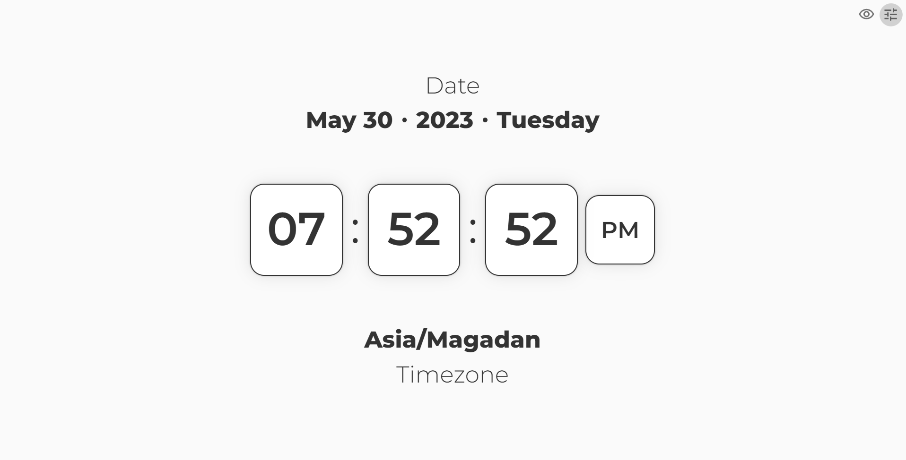
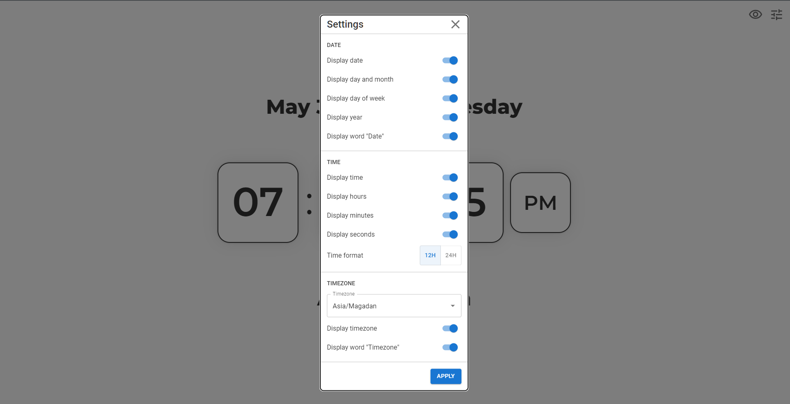
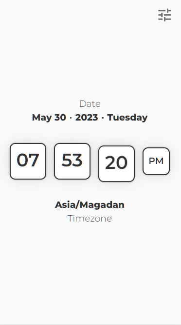

<h1 align="center">Clocks</h1>
<p align="center">
  Made with <code>HTML</code>, <code>CSS</code>, <code>TypeScript</code>, <code>ReactJS</code>, <code>CSS Modules</code>
  <br>
  Bootstrapped with <code>Vite</code>
</p>

<p align="center">
  <a href="../../actions"></a>
  <a href="../../commits"></a>
  <a href="./LICENSE"></a>
  
  
</p>

<p align="center">
  <a href="#-screenshots">🖼 Screenshots</a> • 
  <a href="#ℹ%EF%B8%8F-about">ℹ️ About</a> • 
  <a href="#%EF%B8%8F-tools">⚙️ Tools</a> • 
  <a href="#-build-project">🔨 How to Build Project</a> • 
  <a href="#-file-structure">📁 File Structure</a>
</p>

<sup>
  <p align="center">
    <a href="#-npm-packages-worth-mentioning">📦 NPM Packages worth mentioning</a> • 
    <a href="#-details">💡 Details</a> • 
    <a href="#-useful-resources">🔗 Useful resources</a> • 
    <a href="#-author">👤 Author</a>
  </p>
</sup>

## 🖼 Screenshots

<p align="center">
  
</p>

<p align="center">
  
</p>

<p align="center">
  
</p>

## ℹ️ About

I was fascinated by this codepen: https://codepen.io/jkantner/pen/GRQaPPV.

The challenge is to replicate the logic of this codepen, but using React. Another task was to add several new features and practice with Materal UI.

I made my own Figma prototype and redesigned the whole application.

Figma prototype: https://www.figma.com/file/smtaFQVSv1tBtsiMHWzksy/Time-Now?type=design&node-id=0%3A1&t=w0rQeWcpLc5UCJK0-1

## ⚙️ Tools

- **HTML5**
  - ReactJS
- **CSS**
  - CSS Modules
- **TypeScript**
  - ReactJS
- **Github Pages**

## 🔨 Build project

<table>
  <tr>
    <th>Command</th>
    <th>Description</th>
  </tr>
  <tr>
    <td><code>npm&nbsp;install</code></td>
    <td>First of all install all required packages</td>
  </tr>
  <tr>
    <td><code>npm&nbsp;run&nbsp;dev</code></td>
    <td>Run the app in development mode</td>
  </tr>
  <tr>
    <td><code>npm&nbsp;run&nbsp;build</code></td>
    <td>Build the app</td>
  </tr>
  <tr>
    <td><code>npm&nbsp;run&nbsp;preview</code></td>
    <td>Run the app in production mode</td>
  </tr>
  <tr>
    <td><code>npm&nbsp;run&nbsp;lint</code></td>
    <td>Check compliance with Eslint rules</td>
  </tr>
</table>

## 📁 File Structure

```Markdown
├── 📁 .github
|   ├── 📁 workflows
|   |   └── 📝 main.yaml      CI/CD instructions for Github Actions
│   └── 📝 dependabot.yml     Instructions for Dependabot
|
├── 📁 docs                   Additional information, documentation
│   └── 📁 results            Screenshots of how the application works after being fully developed
|
├── 📁 public                 Assets used in `index.html` (favicon)
|
├── 📁 src                    Source files needed for application development
│   ├── 📁 assets             Static assets: images, icons (empty)
│   ├── 📁 components         React components
│   ├── 📁 components                 React components
|   |   └── 📁 Component Name
|   |       ├── 📝 index.tsx          Component logic
|   |       ├── 📝 index.module.css   Component styles
|   |       └── 📝 index.types.tsx    Component types (optional)
│   ├── 📝 App.tsx            App React component
│   ├── 📝 App.module.scss    App styles (optional)
│   ├── 📝 index.css          Global styles
│   ├── 📝 index.tsx          Entry point for the module bundler
│   └── 📝 vite-end.d.ts          Some Typescript stuff for Vite
|
├── 📝 .eslintrc.cjs          ESLint configuration file
├── 📝 .gitignore             Instructions for Git about what files to ignore
├── 📝 index.html             Main html file
├── 📝 LICENSE                MIT License. Basically you can do whatever you want with the code
├── 📝 README.md              Project description
├── 📝 package-lock.json      Keeps track of the exact version of every package that is installed
├── 📝 package.json           Various metadata relevant to the project, scripts, dependencies
├── 📝 tsconfig.json          TypeScript configuration file
├── 📝 tsconfig.node.json     TypeScript configuration file for Vite
└── 📝 vite.config.js         Vite configuration file
```

## 📦 NPM Packages worth mentioning

<table>
  <tr>
    <td><code>clsx</code></td>
    <td>For conditional lists of CSS classes</td>
  </tr>
  <tr>
    <td><code>mui packages</code></td>
    <td>Popular component library</td>
  </tr>
  <tr>
    <td><code>query-string, <br>react-dom, <br>react-router-dom</code></td>
    <td>For manipulations with query strings</td>
  </tr>
</table>

## 💡 Details

It was the first time when I used Material UI components. They make many things extremely simple. Here are the use cases of using this library:

- Icon buttons. For top right menu
- Modal. For the settings modal window
- Button. Is used in the settings modal window
- Switch. Is also used in the settings modal window
- Autocomplete. Likewise
- Toggle Button Group. Likewise

As far as I know MUI, in theory, may help to completely get rid of CSS and rely only on their components. I decided not to do that and use MUI components only in those places where I found them the most valuable, where they saved much time.

For simpler tasks I relied on CSS.

I love the simplicy of CSS Modules. This feature is built in Vite, no need to configure it. And it's extremely easy to use. It with `clsx` eliminates any need in usin BEM or Styled Components. I absolutely love it.

The main challenge of this task was to make those digits move from top to bottom in a nicely synchronized manner. Spent many hours trying out different ways to reach that goal. What helped is just using a delayed value.

Here how it looks. There is a block. Inside of that block is a flex container with a top and bottom digit group. You animate this flex container on every change of seconds, minutes, or hours (depends on the group).

In the bottom digit group you show a real value. In the top digit group you show a delayed value. It appeared in the end to be nice and easy.

Also this project allowed me to experiment again with custom hooks. I think they enhanced code readability, very glad about that.

Another little achievement is experimenting with `vmin` for sizes. This CSS feature allowed to make the design look great on any screen.

Also I actively used ChatGPT for simple tasks. It still can't gracefully handle complex tasks (or probably I'm just bad at providing correct props), but overall it's a nice addition to StackOverflow!

## 🔗 Useful resources

- Bouncy Block Clock (Codepen) - https://codepen.io/jkantner/pen/GRQaPPV

## 👤 Author

- Frontend Mentor - [@GrbnvAlex](https://www.frontendmentor.io/profile/GrbnvAlex)
- Telegram - [@Arlagonix](https://t.me/Arlagonix)
- Github - [@arlagonix](https://github.com/arlagonix)
